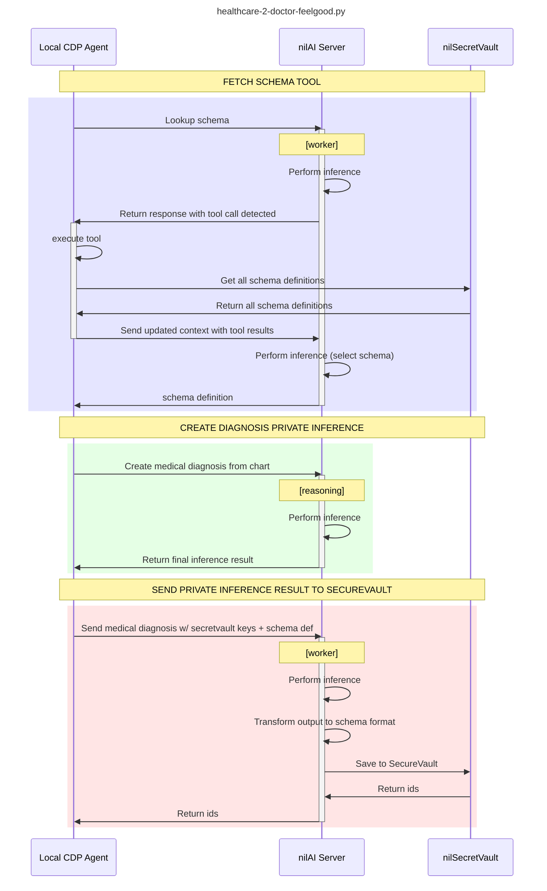

```mermaid
sequenceDiagram
    title healthcare-2-doctor-feelgood.py

    participant Agent as Local CDP Agent
    participant Server as nilAI Server
    participant nilDB as nilSecretVault

    Note over Agent,nilDB: FETCH SCHEMA TOOL
    rect rgba(0, 0, 255, .1)
        Agent->>Server: Lookup schema
        activate Server  
            Note over Server: [worker]        
            Server->>Server: Perform inference
            Server->>Agent: Return response with tool call detected
            activate Agent
                Agent->>Agent: execute tool
                Agent->>nilDB: Get all schema definitions
                nilDB->>Agent: Return all schema definitions
                Agent->>Server: Send updated context with tool results
            deactivate Agent
            Server->>Server: Perform inference (select schema)
            Server->>Agent: schema definition
        deactivate Server

    end

    Note over Agent,nilDB: CREATE DIAGNOSIS PRIVATE INFERENCE
    rect rgba(0, 255, 0, .1)
        Agent->>Server: Create medical diagnosis from chart

        activate Server  
            Note over Server: [reasoning]
            Server->>Server: Perform inference
            Server->>Agent: Return final inference result
        deactivate Server

    end

    Note over Agent,nilDB: SEND PRIVATE INFERENCE RESULT TO SECUREVAULT
    rect rgba(255, 0, 0, .1)
        Agent->>Server: Send medical diagnosis w/ secretvault keys + schema def

        activate Server  
            Note over Server: [worker]
            Server->>Server: Perform inference
            Server->>Server: Transform output to schema format
            Server->>nilDB: Save to SecureVault
            nilDB->>Server: Return ids
            Server->>Agent: Return ids
        deactivate Server

    end
```
